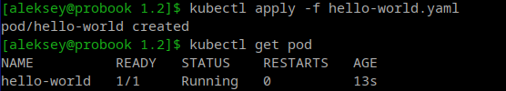
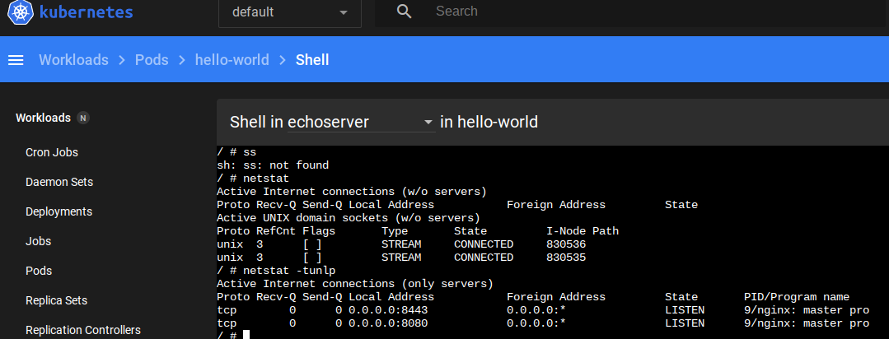
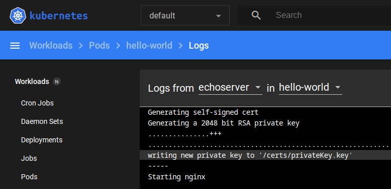
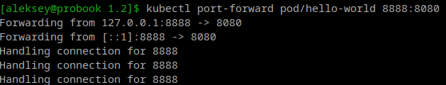
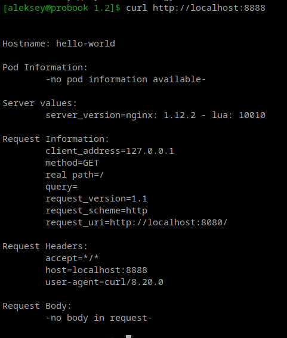
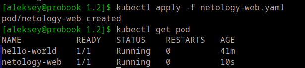
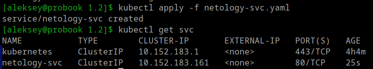
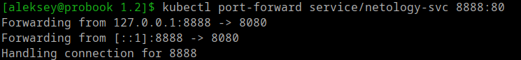
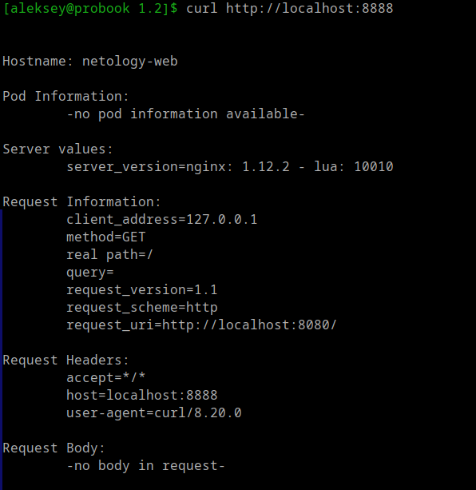

## Домашнее задание к занятию «Базовые объекты K8S»

Для выполнения задания используем ранее созданный кластер на базе microk3s в Yandex cloud из репозитория:
https://github.com/aleksey-dubrovin/yandex-k8s.git.
Выполнил развртывание кластера microk8s, установил dashboard с публикацией через NodePort, настроил подключение к кластеру с локальной машины через API по token.

### Задание 1. Создать Pod с именем hello-world

Создаю манифест для POD с названием hello-world, применяю и проверяю состояние:

---

Проверяю логи и смотрю какие порты слушает контейнер внутри POD. Удобнее мне показалось через dashboard:

---

---

Узнав порт на который ожидает подключения контейнер выполняем проброс по туннелю API.

---

Получаем ответ от POD 

---

### Задание 2. Создать Service и подключить его к Pod

Создаю манифест для POD с названием netology-web, применяю и проверяю состояние:

---
Создаю манифест для Service с названием netology-svc, применяю и проверяю состояние:

---
Создаю туннель через API на порт заданный при создании Service:

---
Получаю ответ от приложения с названием netology-web:

---