## Домашнее задание к занятию «Запуск приложений в K8S»

Выполнения задания продолжаю на тестовом стенде развернутом в Yandex cloud из репозитория: https://github.com/aleksey-dubrovin/yandex-k8s.git. 
Управление кластером выполнятеся с локальной машины через API по token, допонительно развернут dashboard для визаульного отображения.

### Задание 1. Создать Deployment и обеспечить доступ к репликам приложения из другого Pod

Создаю манифест для Deployment из двух контейнеров и одним ReplicaSet.

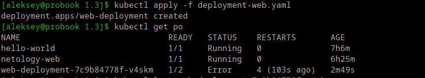
---

Обращаюсь к событиям внутри контейнеров через dashboard:

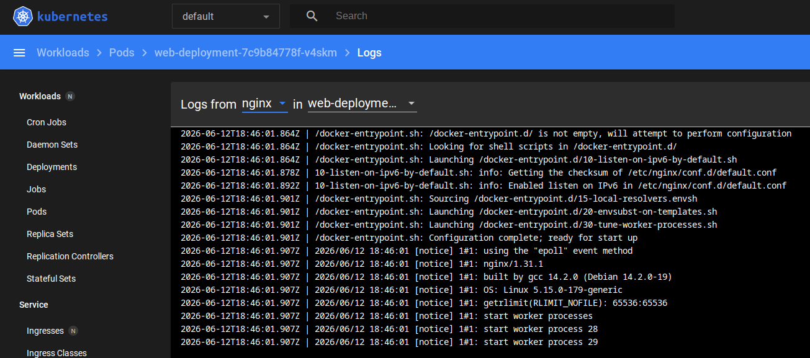
---

При запуске контейнера multitool выдается ошибка:

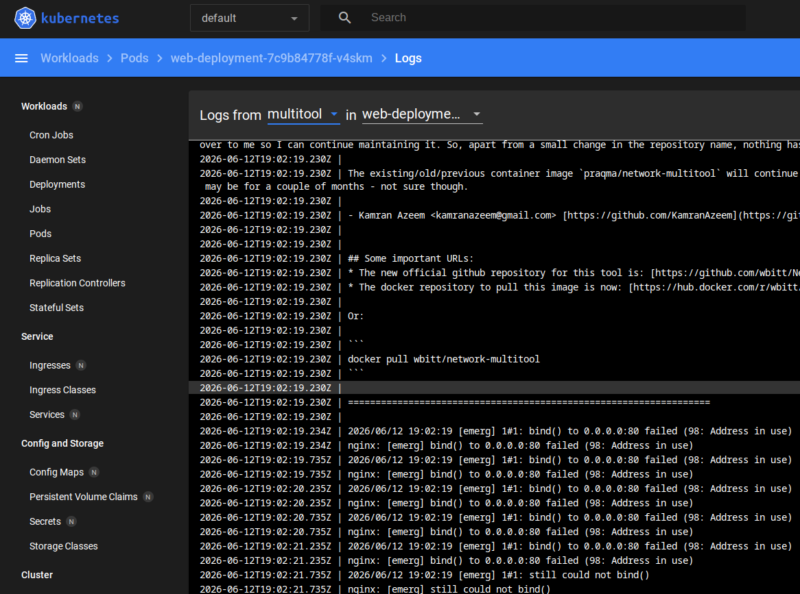
---

Исправляю манифест и разношу контейнеры по портам, задаю переменную окружения для контейнера multitool

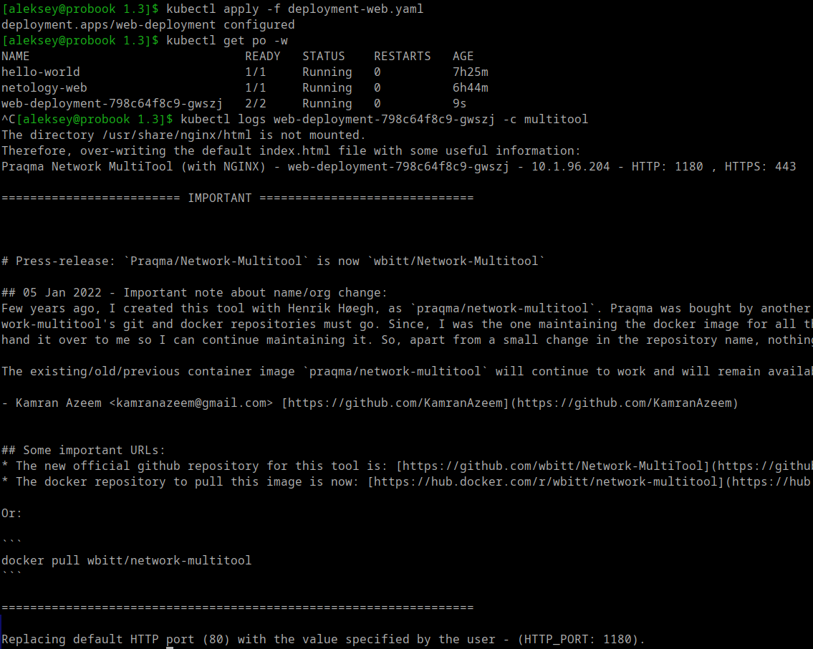
---

Выполняю горизонтальное масштабирование на развернутом Deployment

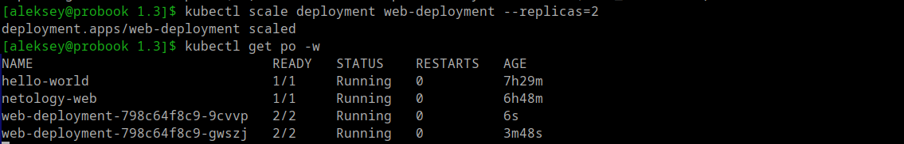
---

Создаю манифест для создания Service и доступа к Deployment web-app

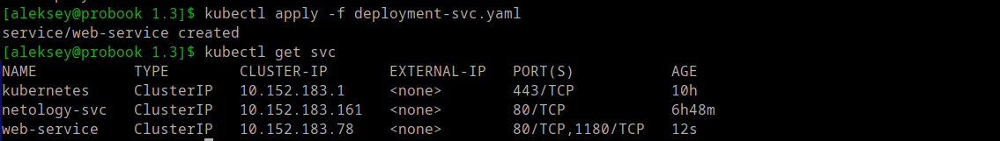
---

Создаю и применяю манифест POD для проверки доступности Service

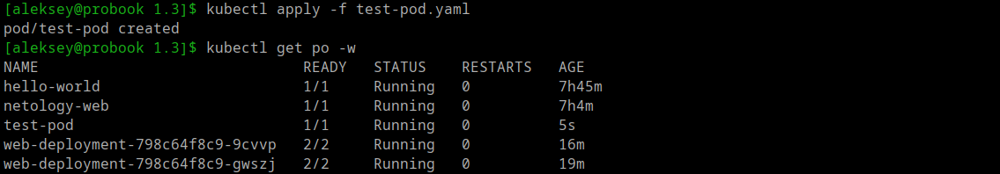
---

Подключаюсь к консоли POD и выполняю HTTP запрос на порты Service с названием web-service

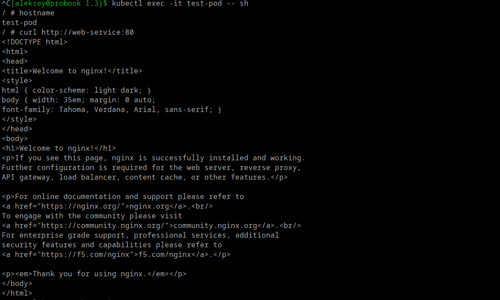
---

Получаю ответ от nginx и multitool

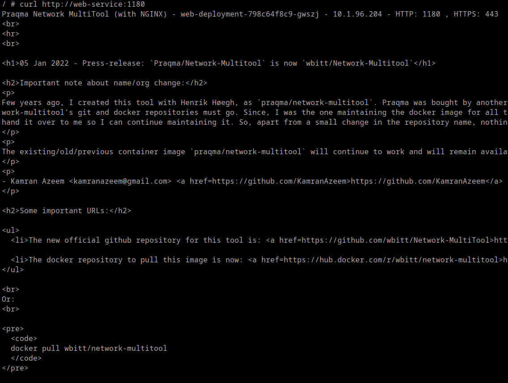
---

### Задание 2. Создать Deployment и обеспечить старт основного контейнера при выполнении условий

Создаю и применю манифест для Deployment состоящий из двух контейнеров с использованием initContainers.

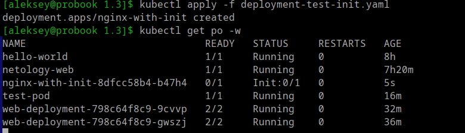
---

Init контейнер поднялся и выполняет проверку.

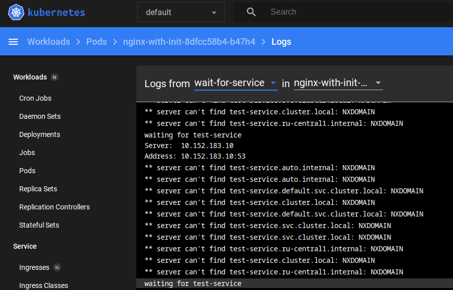
---

Создаю и применяю манифест Service для создания зависимости Init контейнера

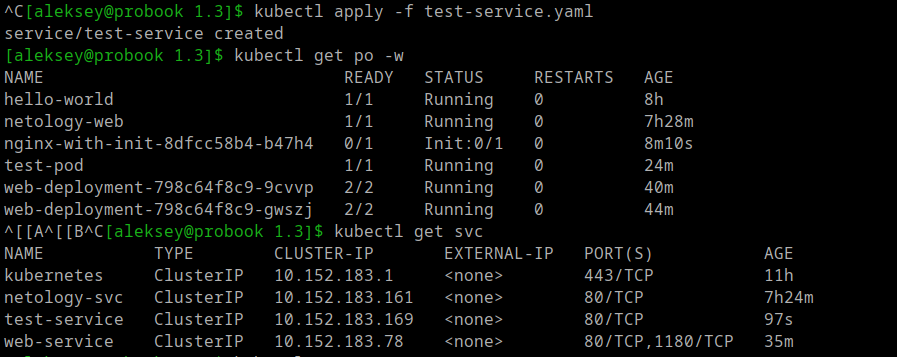
---

Проверка выполнения скрипта для Init контейнера на доступность Service test-service.

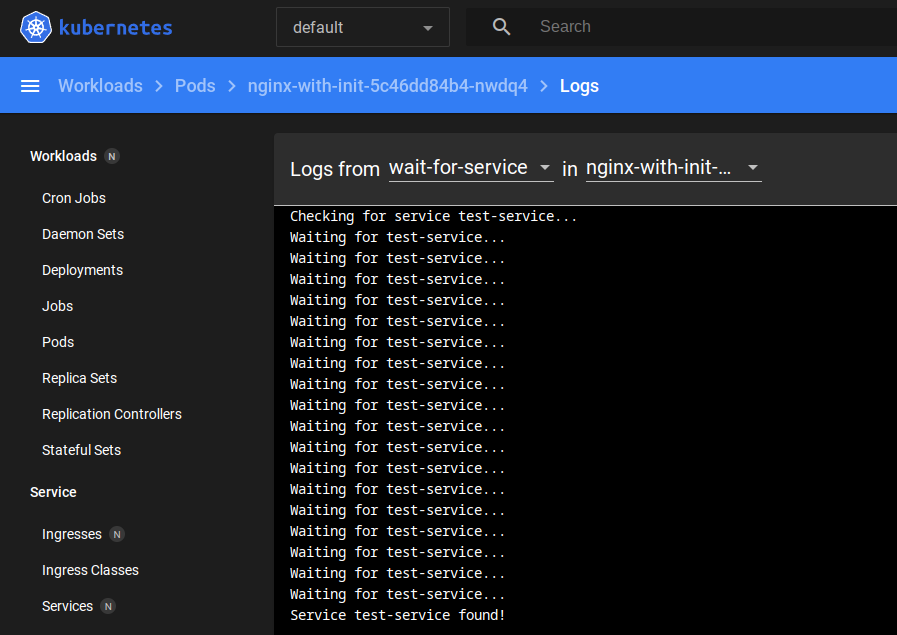
---

Проверка запуска Deployment

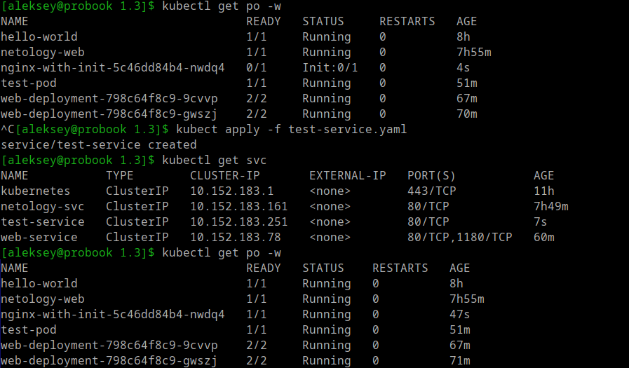
---

