## Домашнее задание к занятию «Сетевое взаимодействие в Kubernetes»

Выполнения задания продолжаю на тестовом стенде развернутом в Yandex cloud из репозитория: https://github.com/aleksey-dubrovin/yandex-k8s.git. 
Управление кластером microk8s выполнятеся с локальной машины через API по token, допонительно развернут dashboard для визаульного отображения объектов.
Для проверки манифестов и конфигурации, установлен плагин Kubernetes в Visual Studio Code.

Перед началом выполняю удаление объектов из предыдущих заданий:

```bash
kubectl delete pods,deployments,services,ingress --all

kubectl get all
```

### Задание 1: Настройка Service (ClusterIP и NodePort)

Создаю и применяю манифест Deployment для развертывания мультиконтейнерных POD:

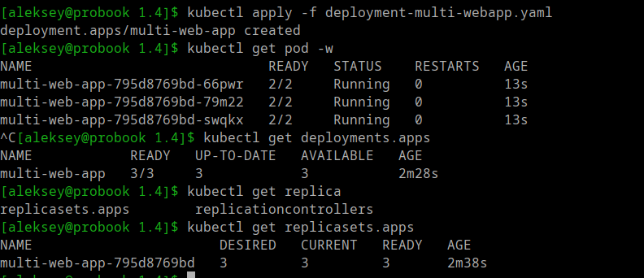
---

Создаю и применяю манифест Sevice для публикации мультиконтейнерных POD через ClusterIP и NodePort:

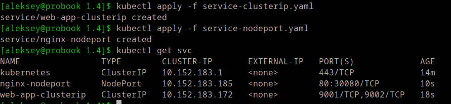
---

Проверяю доступность опубликованных контейнеров внутри кластера через тестовый POD:

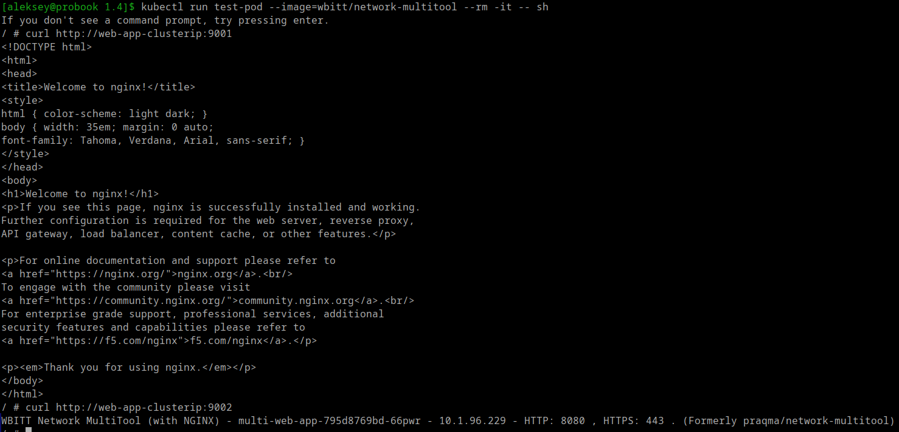
---

Проверяю доступность опубликованных контейнеров наружу кластера, локально:

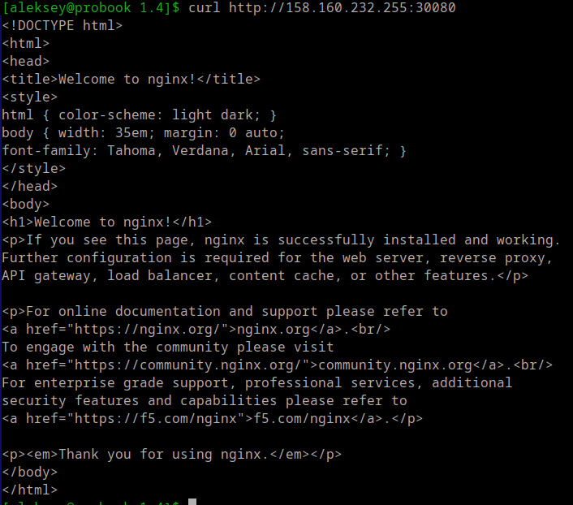
---

### Задание 2: Настройка Ingress

Создаю и применяю манифесты Deployment для развертывания backend и frontend POD c публикацией через ClusterIP:

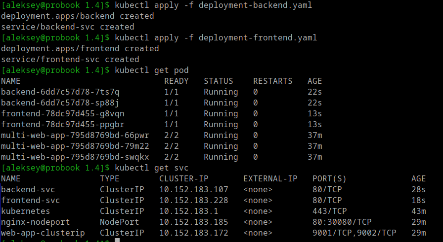
---

Включаю Ingress-контроллер (Traefik) на виртальной машине где работает microk8s:

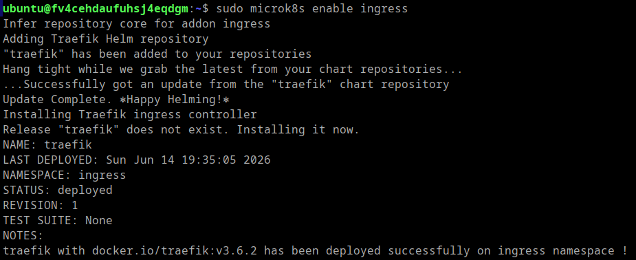
---

Создаю и применяю манифест Ingress для публикации через Ingress-контроллер Traefik:

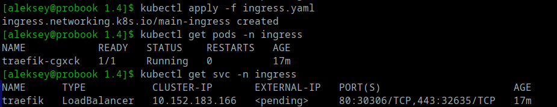
---

Проверяю доступность POD по префиксам через NodePort, так как EXTERNAL-IP в статусе pending (не видит внешний IP адрес).

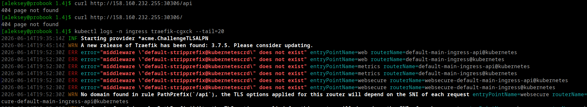
---

Создаю и применяю манифест Middleware и проверяем доступ к POD через NodePort:

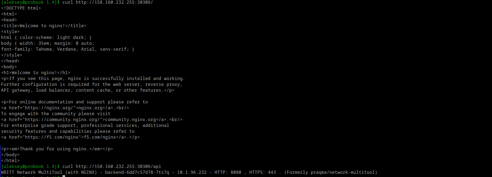
---

Добавил в конфигурацию terraform ресурс NLB для публикации через стандартный порт HTTP:

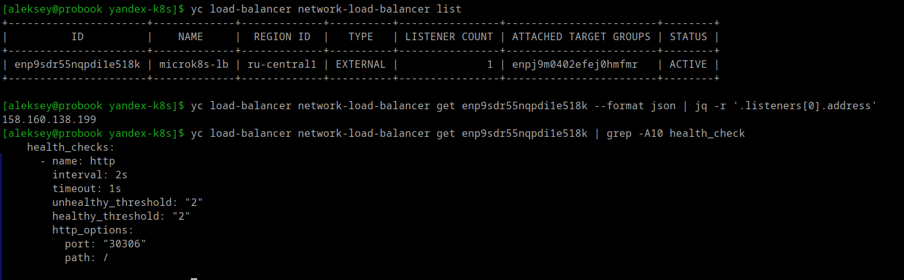
---

Проверяю доступ к POD через IP адрес NLB

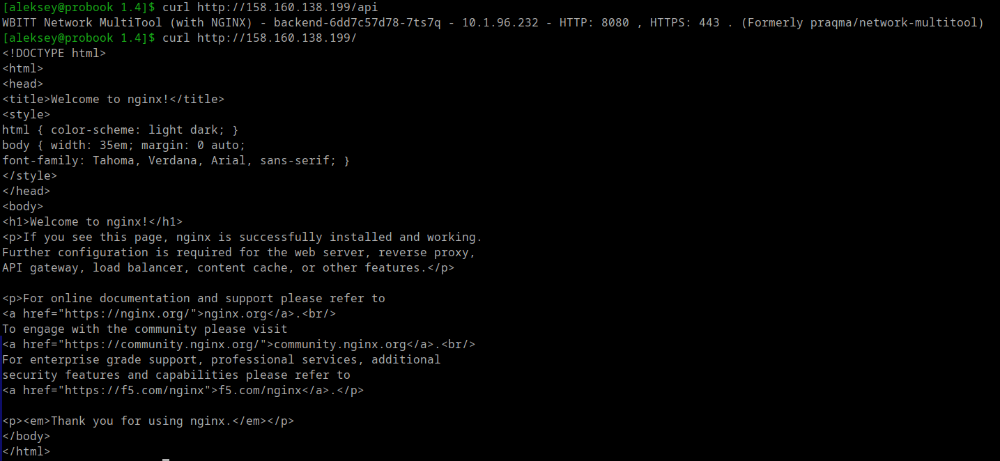
---
