## Домашнее задание к занятию «Хранение в K8s»

Выполнения задания продолжаю на тестовом стенде развернутом в Yandex cloud из репозитория: https://github.com/aleksey-dubrovin/yandex-k8s.git. 
Управление кластером microk8s выполнятеся с локальной машины через API по token, допонительно развернут dashboard для визаульного отображения объектов.
Для проверки манифестов и конфигурации, установлен плагин Kubernetes в Visual Studio Code.

Перед началом выполняю удаление объектов из предыдущих заданий:
```bash
kubectl delete pods,deployments,services,ingress --all

kubectl get all
```

### Задание 1. Volume: обмен данными между контейнерами в поде.

Создаю и применяю манифест Deployment для развертывания мультиконтейнерного POD с emptyDir:

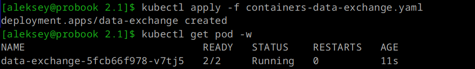
---

Проверяю события контейнера и вывод сообщений в консоль для подтверждения обмена данными. Контейнер reader читает сообщения с датой, которые обновляются каждые 5 секунд от контенера writer:

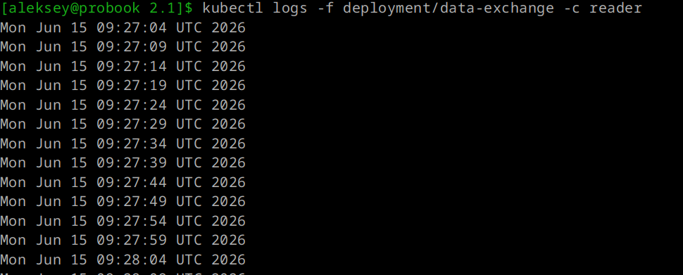
---

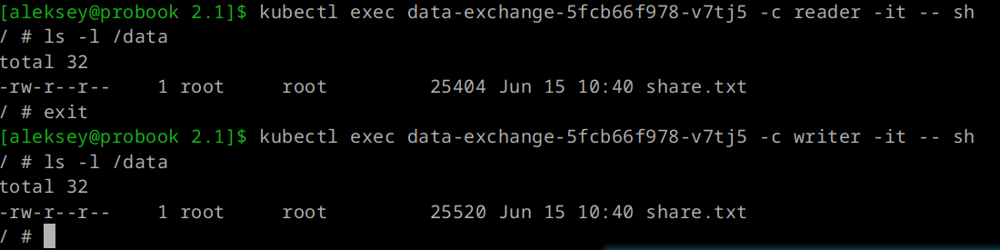
---

Описание POD с двумя контейнерами и смонтированным томом.

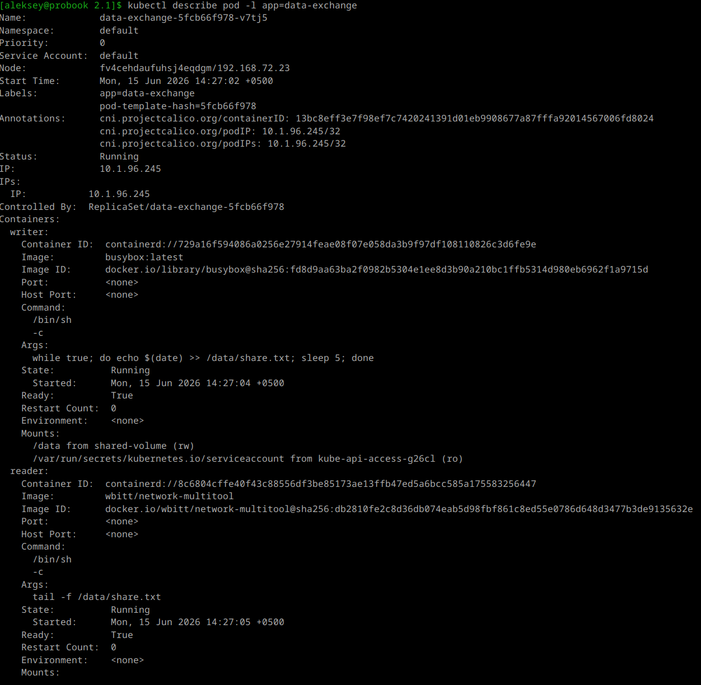
---

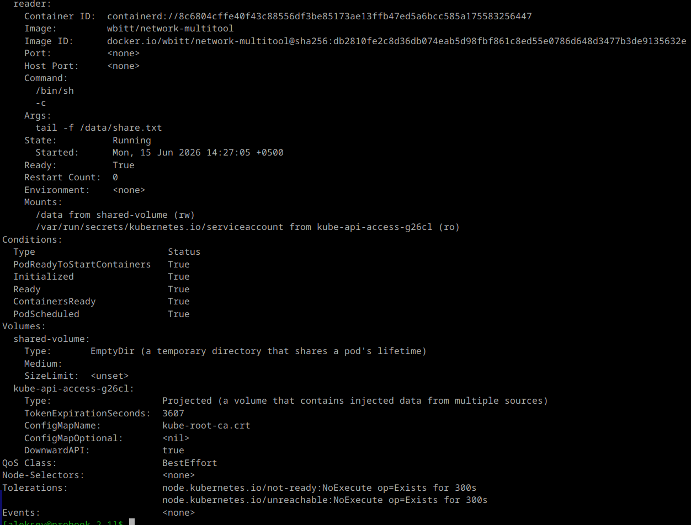
---

### Задание 2. PersistentVolume (PV), PersistentVolumeClaim (PVC).

Создаю и применяю манифест с PersistentVolume и PersistentVolumeClaim:

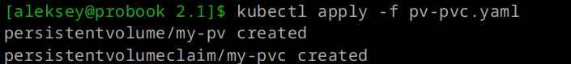
---
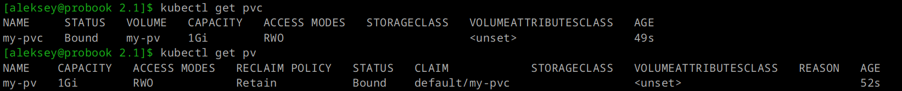
---

Создаю и применяю манифест с Deployment на созданный PVC:

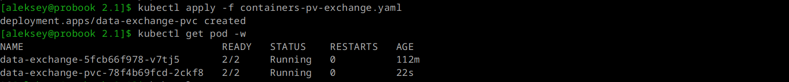
---

Проверяю события чтения из файла в консоли на контейнере reader, а так же на узле:

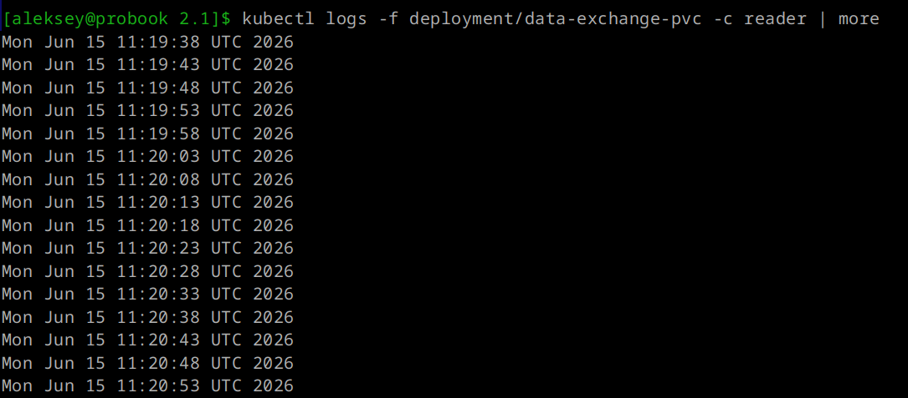
---
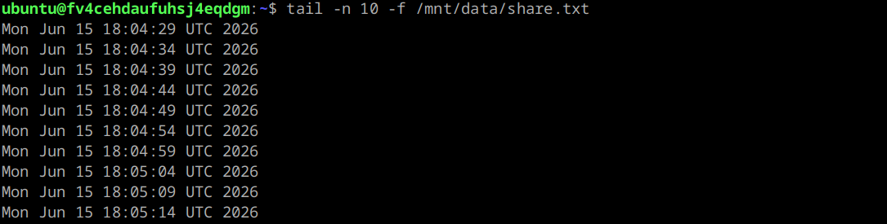
---

Выполняю удаление обектов Deployment и PVC, проверяю состояние PV:

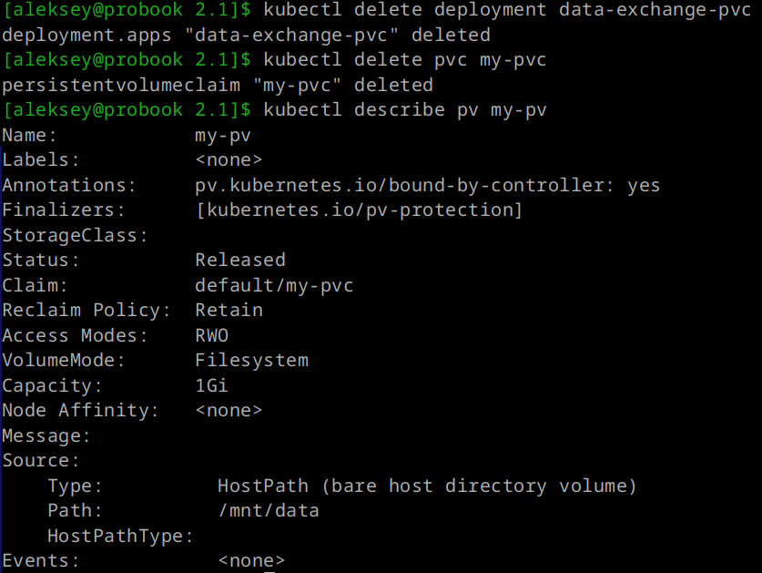
---

***PV перешёл в состояние Released, потому что связанный с ним PVC был удалён. Данные на диске сохранены благодаря политике Retain, но PV больше не может быть использован новым PVC автоматически.***

Проверяю доступность данных на узле по локальному пути:

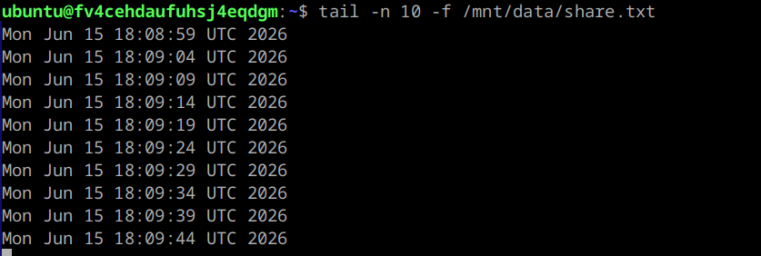
---

Выполняю удаление PV и проверяю доступность данных по локальному пути на узле:

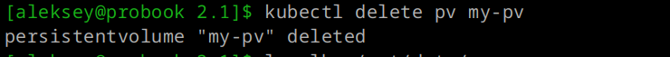
---
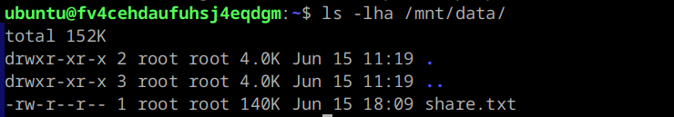
---

***Удаление PV удаляет только Kubernetes-объект, но не трогает физические данные на локальном хранилище узла. Очистка данных — выполняется от имени пользователя с правами root.***

### Задание 3. StorageClass.

Создаю и применяю манифест c StorageClass (SC) для динамического создания PV при создании PVC:

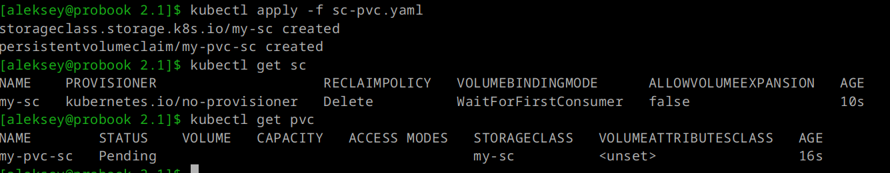
---

Создаю и применяю манифест с Deployment с указанием тома my-pvc-sc:

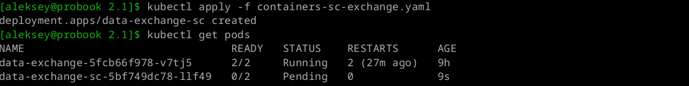
---

***Поскольку provisioner — kubernetes.io/no-provisioner, PVC останется в состоянии Pending, если нет подходящего PV.***

Создаю и применяю манифест с PersistentVolume с указанием класса my-sc, проверяю состояние PVC:

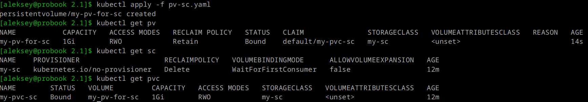
---

Проверяю состояние POD data-exchange-sc и операций чтения из файла в контейнере reader:

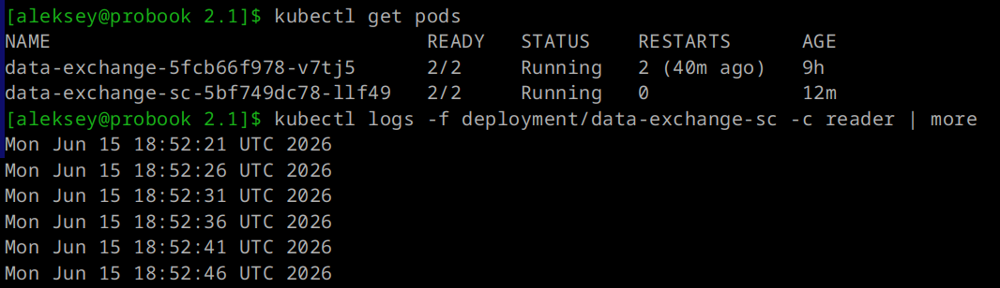
---
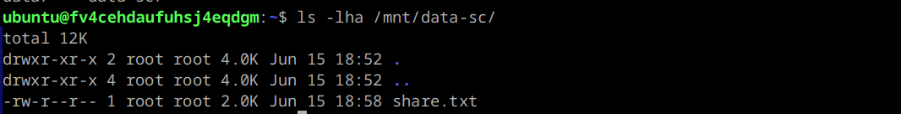
---