## Домашнее задание к занятию «Настройка приложений и управление доступом в Kubernetes»

Выполнения задания продолжаю на тестовом стенде развернутом в Yandex cloud из репозитория: https://github.com/aleksey-dubrovin/yandex-k8s.git. 
Управление кластером microk8s выполнятеся с локальной машины через API по token, допонительно развернут dashboard для визаульного отображения объектов.
Для проверки манифестов и конфигурации, установлен плагин Kubernetes в Visual Studio Code.

Перед началом выполняю удаление объектов из предыдущих заданий:
```bash
kubectl delete pods,deployments,services,ingress --all

kubectl get all
```

### Задание 1: Работа с ConfigMaps.

Создаю и применяю манифест Deployment с двумя контейнерами (nginx и multitool), подключаю к нему веб-страницу через ConfigMap:

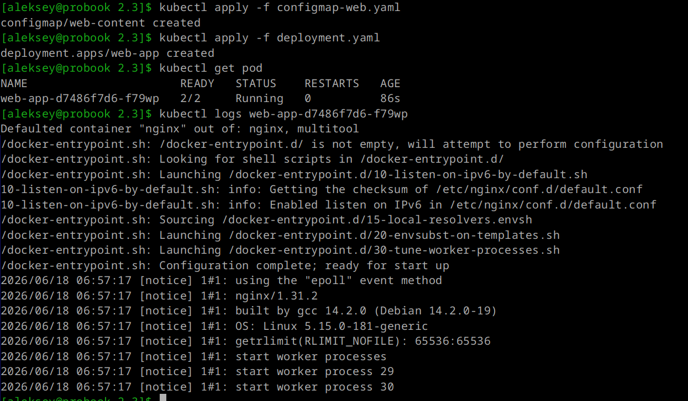
---
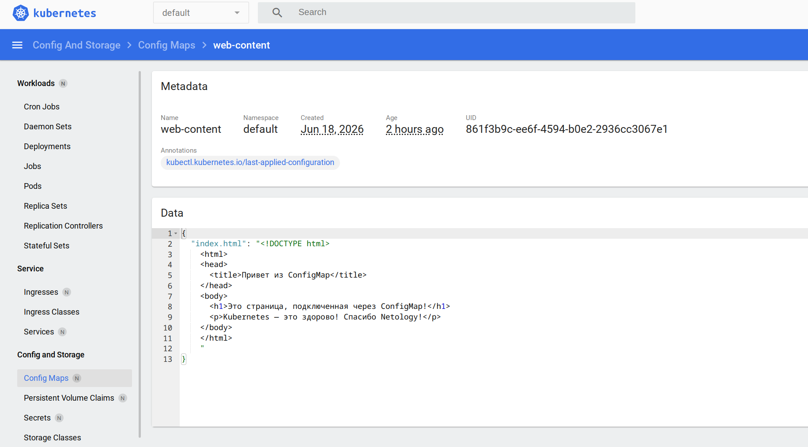
---

*Для веб-страницы логичнее использовать том, смонтировав её в нужную директорию nginx. По умолчанию nginx ищет статические файлы в директории /usr/share/nginx/html.*

Настраиваю проброс портов на ноде port-forward deployment/web-app 8080:80 и проверяю доступность web страницы:

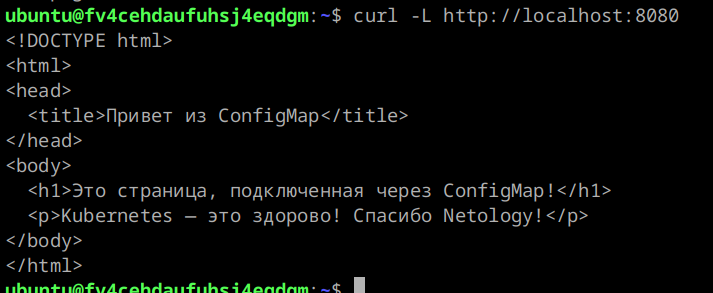
---

### Задание 2: Настройка HTTPS с Secrets.

Генерирую самоподписанный SSL-сертификат, создаю из него Secret:

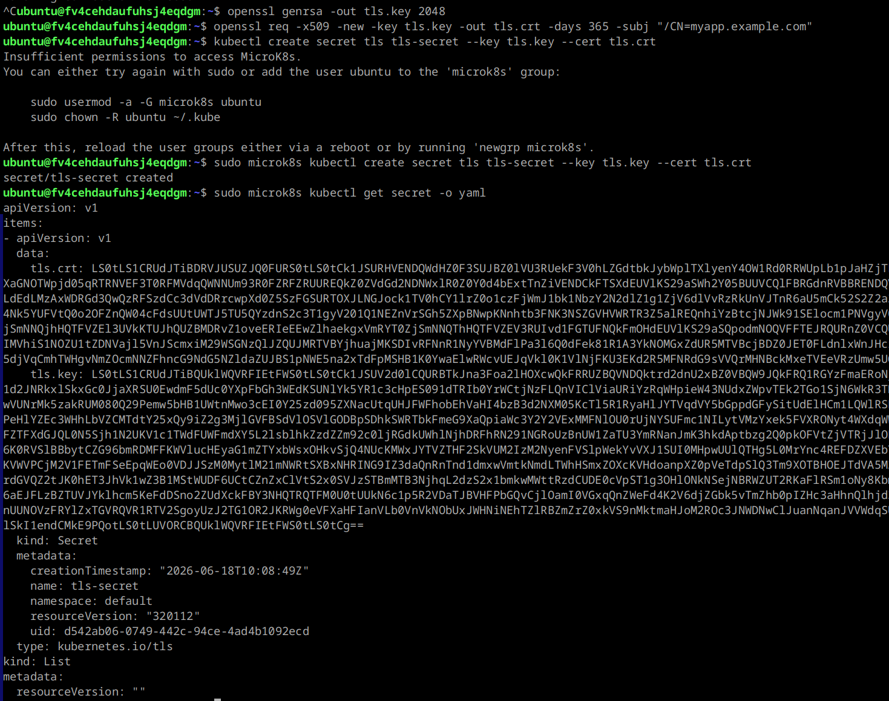
---

Создаю и применяю манифест Ingress для доступа к приложению по HTTPS:

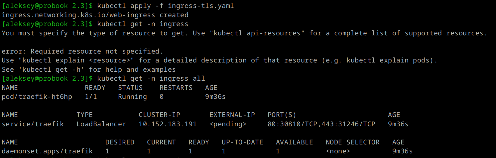
---

Проеряю доступность web-app через ingress controller traefik:

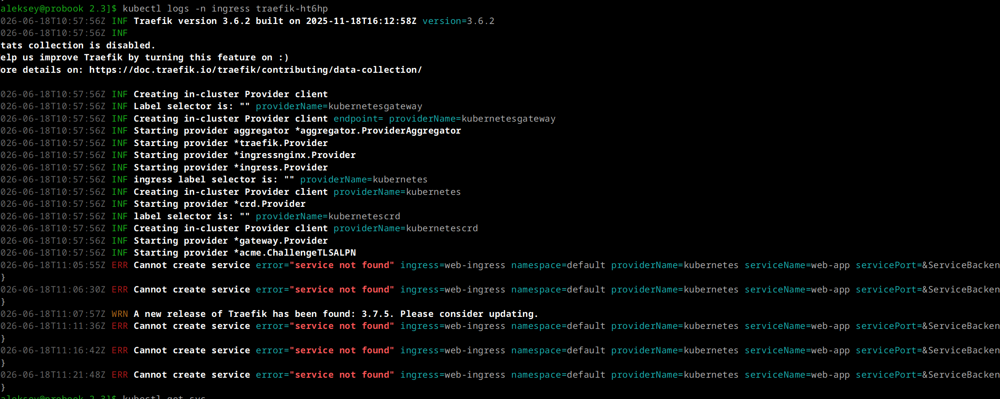
---

Создаю и применяю манифест Service для доступа к web-app, пересоздаю ingress под:

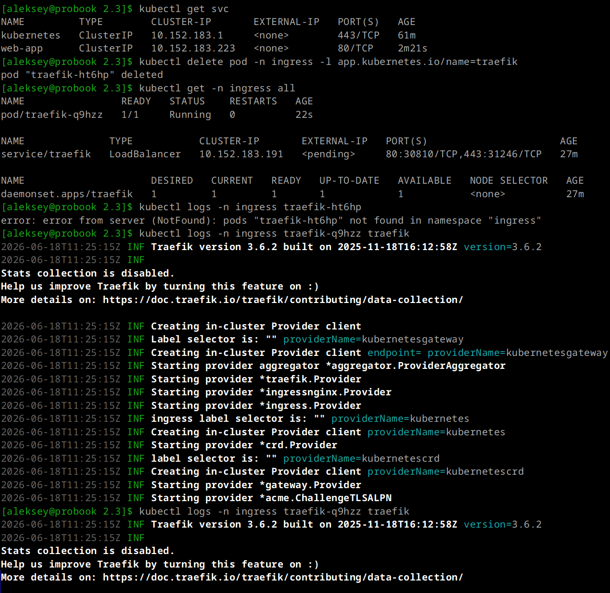
---

Проверяю доступность web-app через ingress controller traefik:

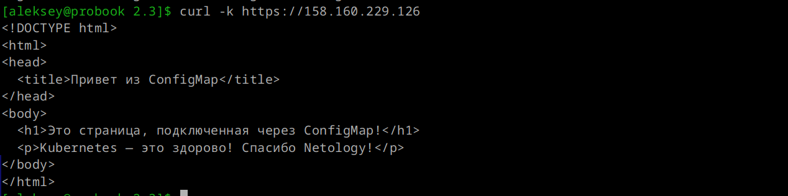
---
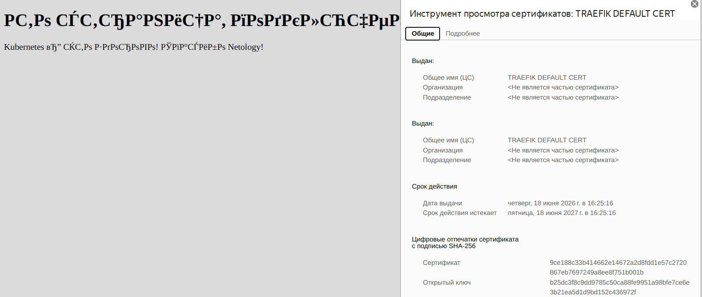
---

* Для корректного отображения текста, исправляю манифест ConfigMap. Нужно добавить строку <meta charset="UTF-8"> в раздел <head>.*

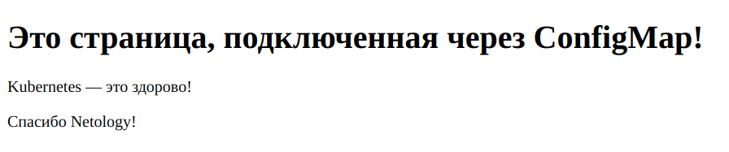
---

### Задание 3: Настройка RBAC.

Включаю компонент rbac и готовлю сертификат для пользователя:

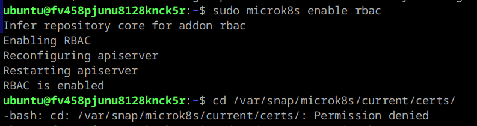
---
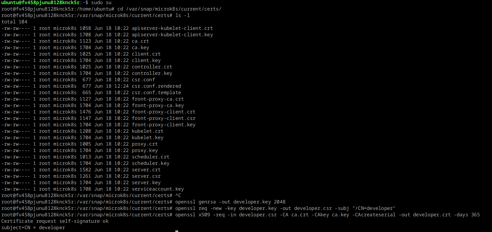
---

Создаю и применяю манифесты Role, RoleBinding с для пользователя developer.

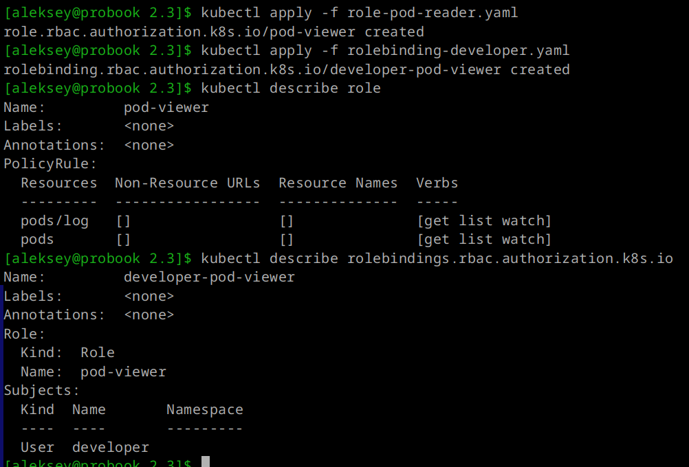
---

Создаю контекст для кластера с доступом пользователя, переключаюсь в новый контекст developer:

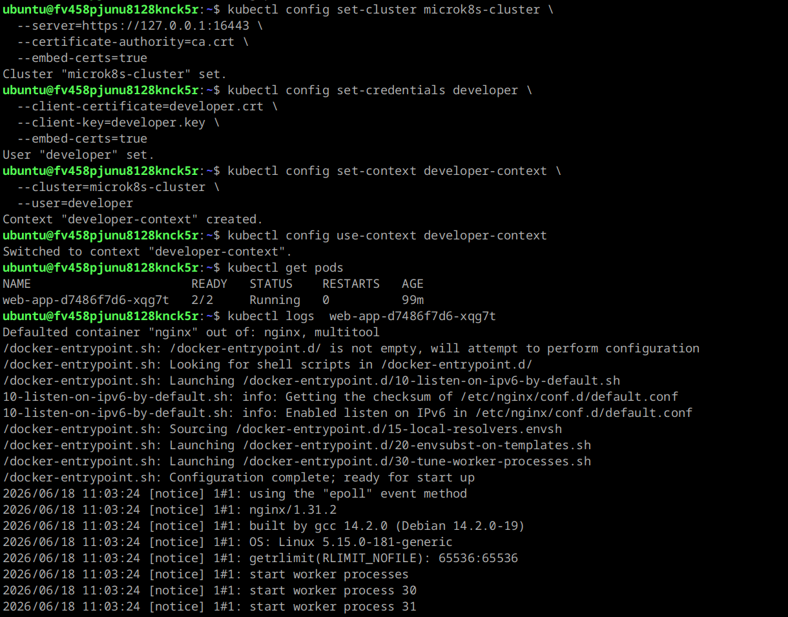
---

Проверяю доступ к администрированию под новым контекстом:

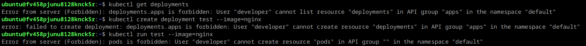
---
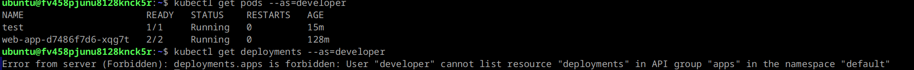
---