## Домашнее задание к занятию «Helm»

Выполнения задания продолжаю на тестовом стенде развернутом в Yandex cloud из репозитория: https://github.com/aleksey-dubrovin/yandex-k8s.git. 
Управление кластером microk8s выполнятеся с локальной машины через API по token, допонительно развернут dashboard для визуального отображения объектов.
Для проверки манифестов и конфигурации, установлен плагин Kubernetes в Visual Studio Code.

Перед началом выполняю удаление объектов из предыдущих заданий:
```bash
kubectl delete pods,deployments,services,ingress --all

kubectl get all
```

### Задание 1. Подготовить Helm-чарт для приложения.

Выполняю установку пакетного менеджера Helm на локальную станцию:

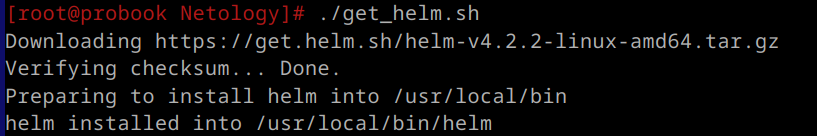
---
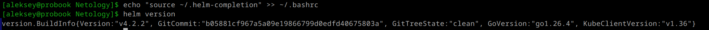
---

Создаю базовую схему (Helm chart) для развертывания приложений, заполняю метаданные и наполяю переменными. Тестирую Helm-чарт на корректность синтаксиса и проверяю сгенерированные манифесты:

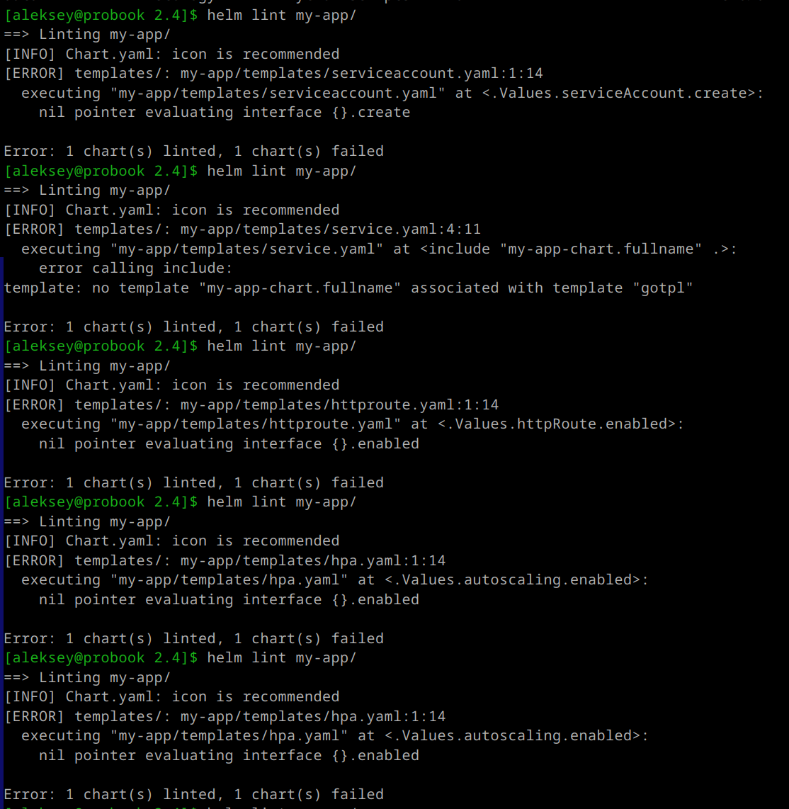
---
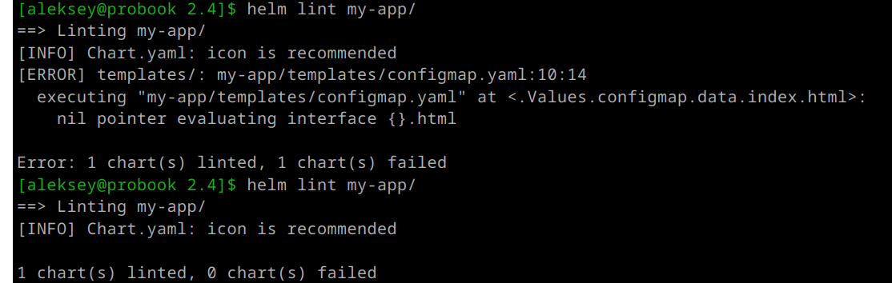
---
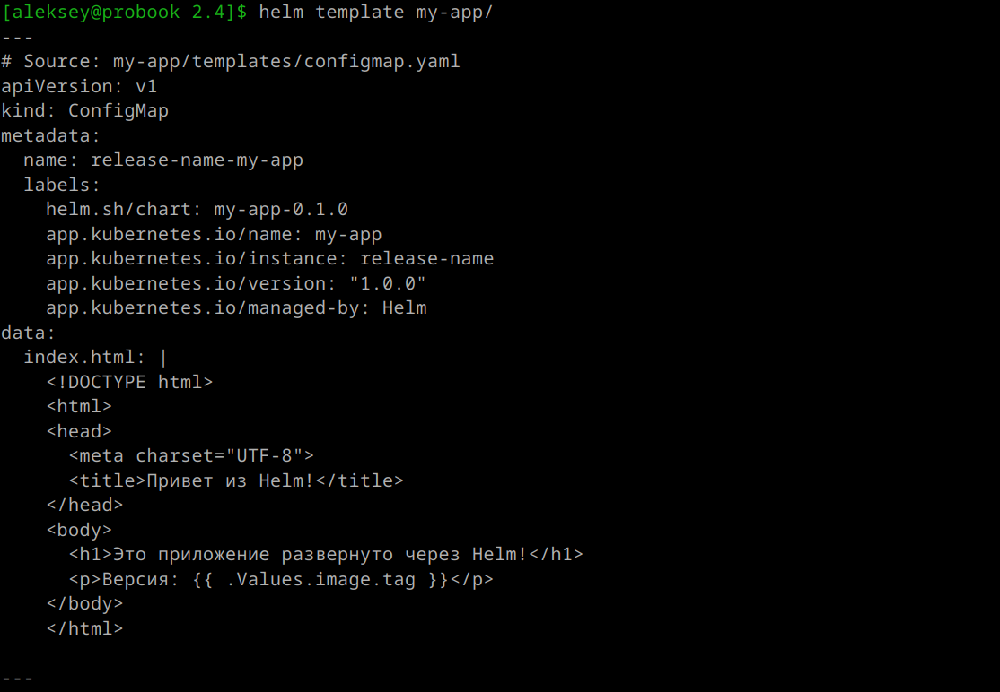
---
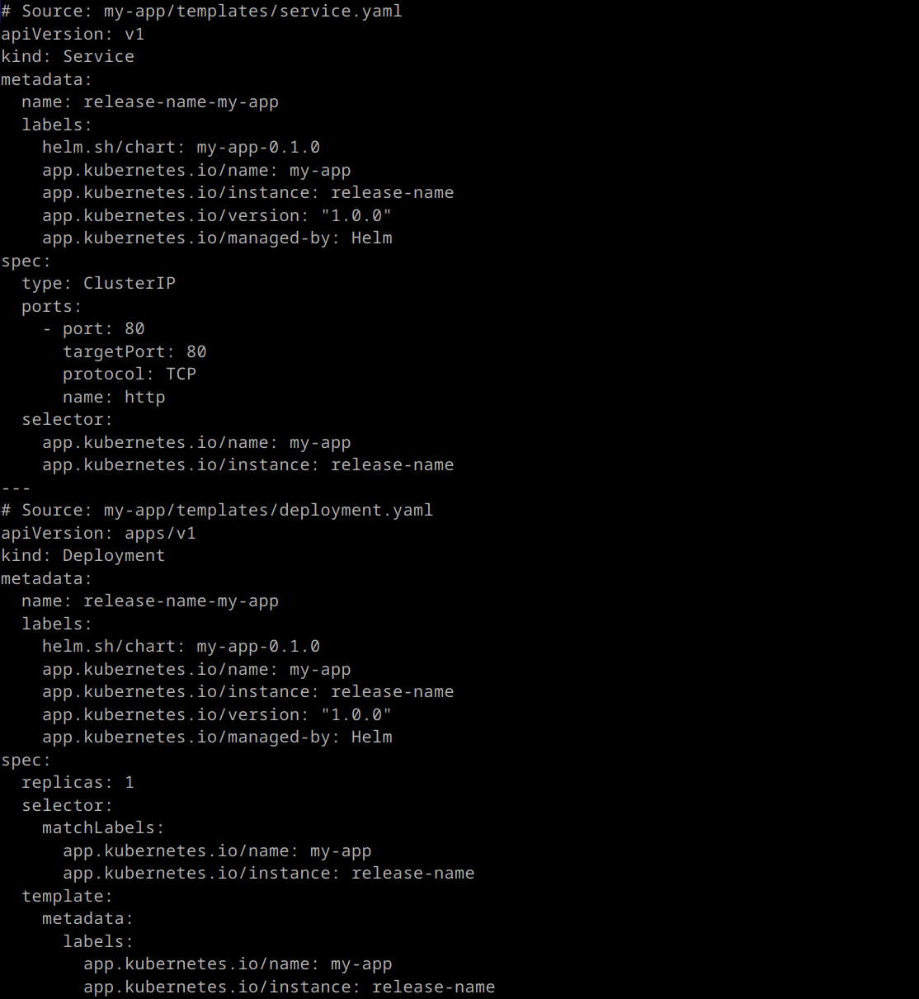
---
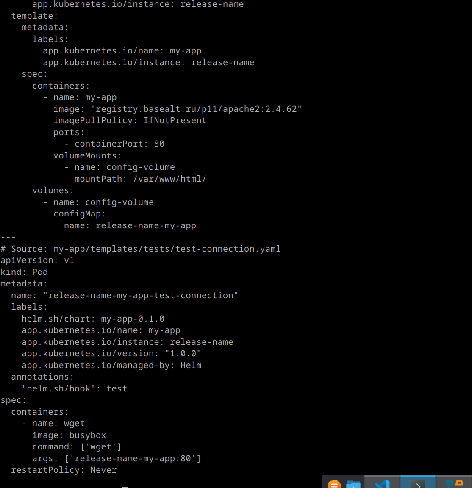
---

*Для развертывания приложений вношу изменения в chart, depoyment, service, configmap и за основу беру образ registry.basealt.ru/p11/apache2.*

Создаю окружение (namespace) stage для развертывания релиза 2.4.62 и выполняю установку Helm-chart:

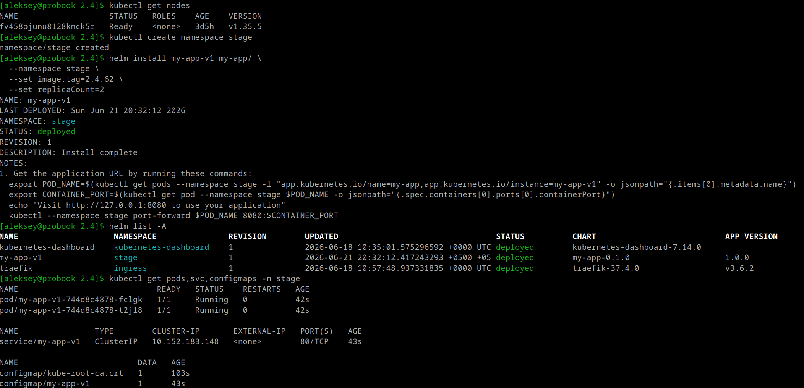
---
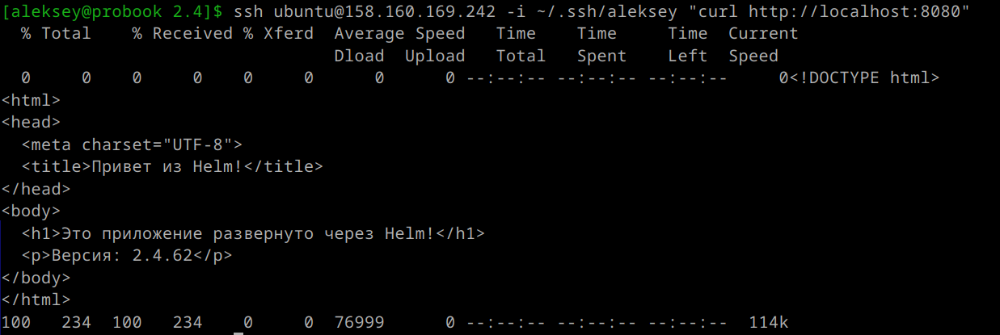
---

Создаю окружение (namespace) prod для развертывания релиза 2.4.62 и выполняю установку Helm-chart:

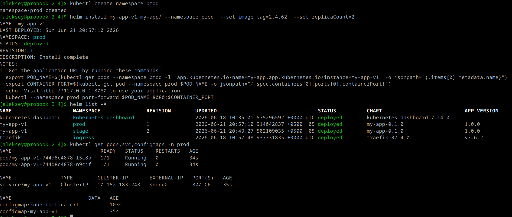
---

Вношу изменения в переменные с указанием нового релиза 2.4.67, выполняю установку Helm-chart и проверяю вывод страницы:

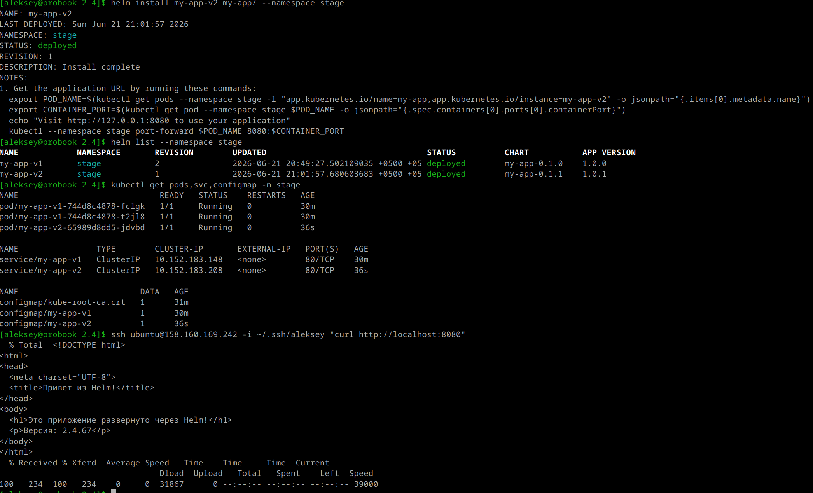
---

Дополнительно добавил шаблон для Ingress и Middleware с перенаправлением в Service через разные Namespace:

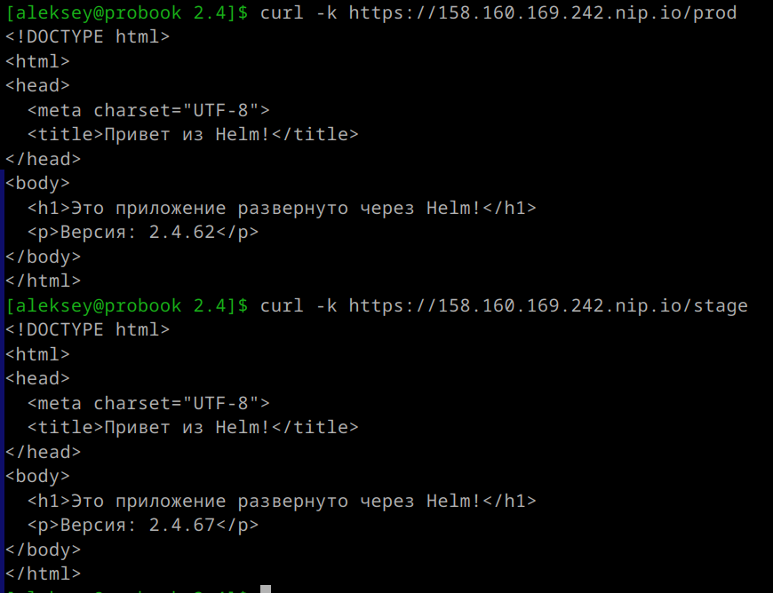
---
