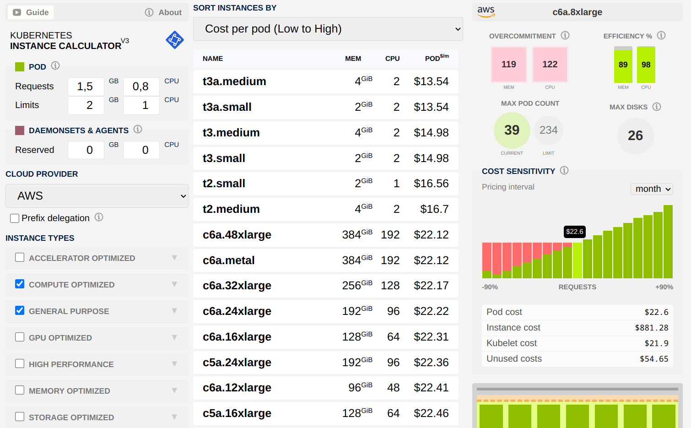

# Домашнее задание к занятию «Компоненты Kubernetes»

Рассчитать требования к кластеру под проект

## Задание. Необходимо определить требуемые ресурсы.

На этом этапе мы исходим только из **потребностей приложения** и **отказоустойчивости**, не учитывая стоимость инстансов.

### 1.1. Суммарные требования всех компонентов

| Компонент | Ресурсы на 1 реплику | Кол-во реплик | Итого CPU | Итого RAM |
| :--- | :--- | :--- | :--- | :--- |
| **База данных** | 1 ядро, 4 ГБ | 3 | **3 ядра** | **12 ГБ** |
| **Кеш** | 1 ядро, 4 ГБ | 3 | **3 ядра** | **12 ГБ** |
| **Фронтенд** | 0.2 ядра, 50 МБ | 5 | **1 ядро** | **250 МБ** (~0.25 ГБ) |
| **Бекенд** | 1 ядро, 600 МБ | 10 | **10 ядер** | **6 ГБ** |
| **ИТОГО** | | | **17 ядер** | **~30.25 ГБ** |

**Вывод:** Для работы всех подов приложения требуется минимум **17 vCPU** и **30.25 ГБ RAM**.

---

### 1.2. Выбор базового инстанса и расчет доступных ресурсов

Допустим, мы рассматриваем инстанс с характеристиками **8 vCPU и 32 ГБ RAM**.

**Расчет резервирования ресурсов на одной ноде** (по формулам из статьи learnkube.com):

**CPU:**
*   6% от 1 ядра = 60m
*   1% от 2 ядра = 10m
*   0.5% от 3-4 ядер = 10m
*   0.25% от 5-8 ядер = 10m
*   **Итого зарезервировано CPU:** 90m (~0.09 ядра)
*   **Доступно CPU:** ~7.9 ядер

**RAM:**
*   25% от первых 4 ГБ = 1 ГБ
*   20% от следующих 4 ГБ = 0.8 ГБ
*   10% от следующих 8 ГБ = 0.8 ГБ
*   6% от следующих 16 ГБ (но у нас только 32 ГБ) = 0.96 ГБ
*   **Итого зарезервировано RAM:** 3.56 ГБ
*   **Порог вытеснения:** 0.1 ГБ
*   **Доступно RAM:** 32 - 3.56 - 0.1 = **~28.34 ГБ**

**Результат для одной ноды (8 vCPU, 32 ГБ RAM):**
*   Доступно CPU: **~7.9 ядер**
*   Доступно RAM: **~28.34 ГБ**

---

### 1.3. Минимальное количество нод (без запаса)

*   **По CPU:** 17 ядер / 7.9 ядер ≈ 2.15 → **3 ноды**
*   **По RAM:** 30.25 ГБ / 28.34 ГБ ≈ 1.07 → **2 ноды**

Выбираем большее значение: **3 ноды**.

---

### 1.4. Количество нод с учетом отказоустойчивости (запас на 1 ноду)

Добавляем 1 резервную ноду для обеспечения работы при отказе любой из основных.

*   **Итого:** 3 + 1 = **4 ноды** (типа 8 vCPU, 32 ГБ RAM).

**Проверка:** При падении одной ноды, на оставшихся 3 нодах доступно:
*   CPU: 7.9 * 3 = 23.7 ядер (запас 6.7 ядер относительно 17 требуемых)
*   RAM: 28.34 * 3 = 85.02 ГБ (запас 54.77 ГБ)

**Вывод по теоретическому расчету:** Для размещения приложения с учетом отказоустойчивости требуется **4 ноды** с характеристиками **8 vCPU и 32 ГБ RAM**.

---

Теперь, имея эталонный расчет (4 ноды по 8 vCPU, 32 ГБ RAM), мы используем **Kubernetes Instance Calculator** для сравнения различных инстансов по стоимости и эффективности.

### 2.1. Входные данные для калькулятора

Для расчета одного пода я взял усредненные значения на основе суммарных требований:

*   **Средний pod:**
    *   Requests: 0.8 CPU, 1.5 GB RAM
    *   Limits: 1.0 CPU, 2.0 GB RAM
*   **DaemonSets Reserved:** 0.1 CPU, 0.5 GB RAM (для системных подов)
*   **Cloud provider:** AWS (для примера)



### 2.2. Результаты сравнения

| Инстанс | vCPU | RAM (ГиБ) | Стоимость (усл. ед.) | Эффективность | Стоимость за 1 vCPU | Стоимость за 1 ГБ RAM |
| :--- | :--- | :--- | :--- | :--- | :--- | :--- |
| **c6a.8xlarge** | 32 | 64 | $22.60 | **Высокая** | **$0.71** | **$0.35** |
| c5a.8xlarge | 32 | 64 | $22.74 | Высокая | $0.71 | $0.36 |
| **c6a.4xlarge** | 16 | 32 | $23.19 | Средняя | **$1.45** | **$0.72** |
| c5a.4xlarge | 16 | 32 | $23.34 | Средняя | $1.46 | $0.73 |
| **t3a.2xlarge** | 8 | 32 | $24.06 | Низкая | **$3.01** | **$0.75** |

**Анализ:**
*   Инстанс `c6a.8xlarge` (32 vCPU, 64 ГБ RAM) является **самым экономически эффективным**: стоимость за 1 vCPU в 2 раза ниже, чем у `c6a.4xlarge`, и в 4 раза ниже, чем у `t3a.2xlarge`.
*   Крупные инстансы выгоднее благодаря меньшим накладным расходам на служебные нужды (подтверждение теории из статьи).

### 2.3. Финальное решение

На основе экономического анализа я выбираю инстанс **`c6a.8xlarge` (32 vCPU, 64 ГБ RAM)**.

**Расчет количества нод:**
*   Одна нода `c6a.8xlarge` после резервирования предоставляет ~30 vCPU и ~60 ГБ RAM.
*   Этого достаточно для размещения всех подов приложения (17 vCPU, 30.25 ГБ RAM).
*   Для обеспечения отказоустойчивости добавляем **1 резервную ноду**.
*   **Итого:** **2 ноды** `c6a.8xlarge`.

**Сравнение с теоретическим расчетом:**

| Параметр | Теоретический расчет | Финальное решение |
| :--- | :--- | :--- |
| **Тип ноды** | 8 vCPU, 32 ГБ RAM | **32 vCPU, 64 ГБ RAM** |
| **Количество нод** | 4 | **2** |
| **Общая мощность** | 32 vCPU, 128 ГБ RAM | **64 vCPU, 128 ГБ RAM** |
| **Обоснование** | Исходили только из ресурсов | **Экономическая эффективность** (низкая стоимость за vCPU и RAM) |

---

### 3.1. Использование свободных ресурсов для Dev/Stage

Кластер из 2 нод `c6a.8xlarge` имеет значительный запас:
*   Всего доступно: ~60 vCPU, ~120 ГБ RAM.
*   Продакшн использует: 17 vCPU, 30.25 ГБ RAM.
*   **Свободно:** ~43 vCPU, ~90 ГБ RAM.

Эти ресурсы можно использовать для:
*   Развертывания **namespace'ов для разработки (dev)** и **тестирования (stage)** с уменьшенным количеством реплик и пониженными `requests`/`limits`.
*   Это позволяет экономить инфраструктурные затраты.

**Пример настройки в Helm-чарте:**

В файле `values-dev.yaml`:
```yaml
backend:
  replicaCount: 2
  resources:
    requests:
      cpu: 200m
      memory: 256Mi

database:
  replicaCount: 1
  resources:
    requests:
      cpu: 200m
      memory: 1Gi
```

### 3.2. Приоритезация Production-подов

Для защиты критичных **production-подов** от вытеснения при дефиците ресурсов используем **PriorityClass**:

1.  Создаем `PriorityClass` с высоким приоритетом:
```yaml
apiVersion: scheduling.k8s.io/v1
kind: PriorityClass
metadata:
  name: production-high
value: 1000000
globalDefault: false
description: "High priority for production workloads."
```

2.  Применяем к pod'ам в namespace `production`:
```yaml
spec:
  priorityClassName: production-high
```

3.  Dev/stage поды получают более низкий приоритет.

**Результат:** При нехватке ресурсов scheduler вытесняет pod'ы с низким приоритетом, освобождая место для production-подов.

---

## Итоговое решение

| Параметр | Значение |
| :--- | :--- |
| **Тип worker нод** | `c6a.8xlarge` (32 vCPU, 64 ГБ RAM) |
| **Количество worker нод** | **2** (1 основная + 1 резервная) |
| **Общая мощность кластера** | ~60 vCPU, ~120 ГБ RAM (доступно для подов) |
| **Использование ресурсов** | Продакшн (~28% CPU, ~25% RAM). Свободные ресурсы — для dev/stage |
| **Приоритезация** | Production поды имеют высокий приоритет через PriorityClass |
| **Управление окружениями** | Единый Helm-чарт с параметризованными значениями |

**Обоснование:**
1.  **Теоретический расчет** показал необходимость 4 нод по 8 vCPU и 32 ГБ RAM.
2.  **Экономический анализ** выявил, что инстанс `c6a.8xlarge` значительно выгоднее за счет низкой стоимости за vCPU и RAM.
3.  **Финальное решение** (2 ноды `c6a.8xlarge`) обеспечивает отказоустойчивость, экономическую эффективность и гибкость для размещения нескольких окружений.