## Домашнее задание к занятию «Установка Kubernetes».

Установить кластер K8s.

### Задание 1. Установить кластер k8s с 1 master node.

Для подготовки нод кластера использую IaC terraform с настроенным сценарием cloud-init в Yandex Cloud.

Репозиторий с описанием решения по адресу: https://github.com/aleksey-dubrovin/yandex-k8s-ha.git.

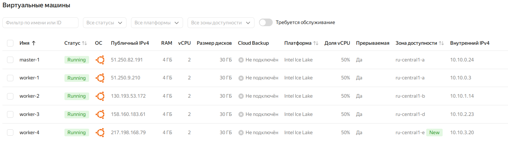
---
Подключаюсь по ssh к мастер-ноде и проверяю настройку зависимостей:

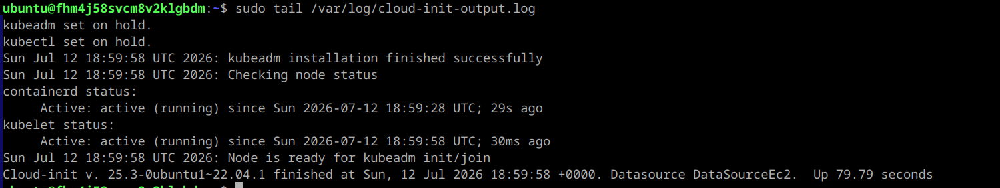
---
Выполняю создание кластера по [Инструкции по установке kubeadm](https://kubernetes.io/docs/setup/production-environment/tools/kubeadm/create-cluster-kubeadm/).

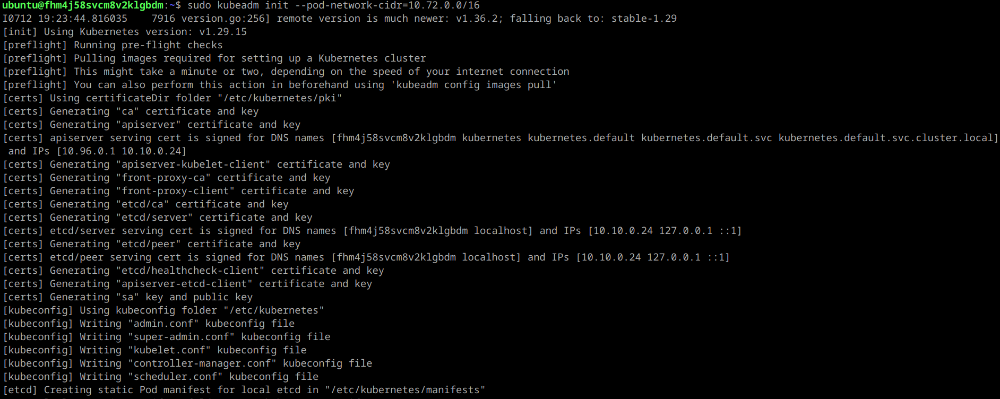
---
Фиксирую строку подключения для воркер-нод в кластер:

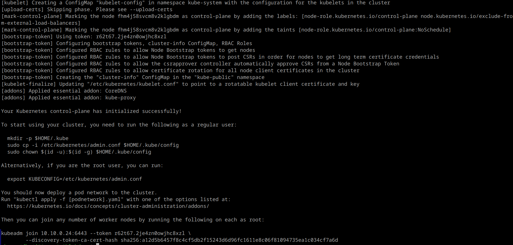
---
Копирую конфигурацию для текущего пользователя:

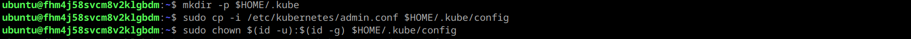
---
Устанавливаю сетевой плагин Calico и переключаю на режим VXLAN (vxlanMode: Always) так как ноды в разных зонах доступности:

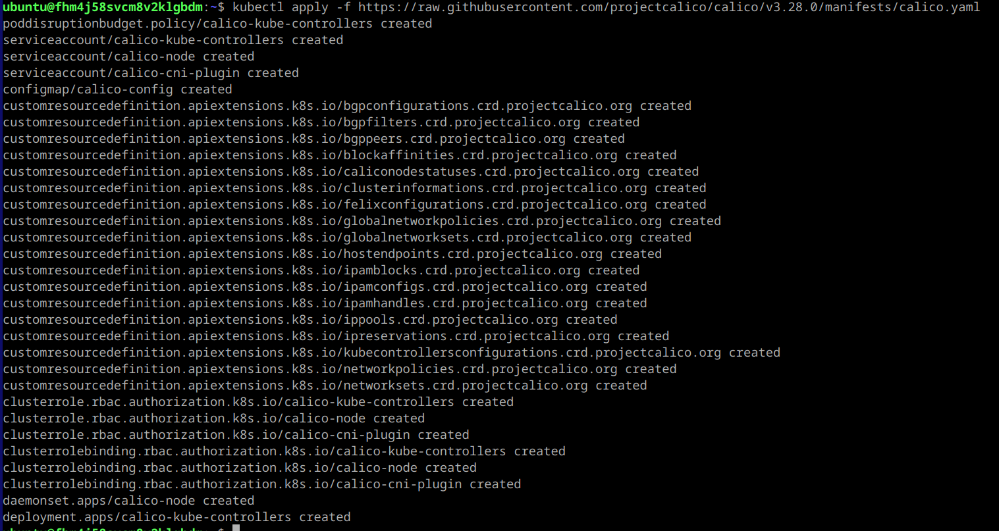
---
Делаю простой скрипт с циклом подключения каждой воркер-ноды к кластеру:

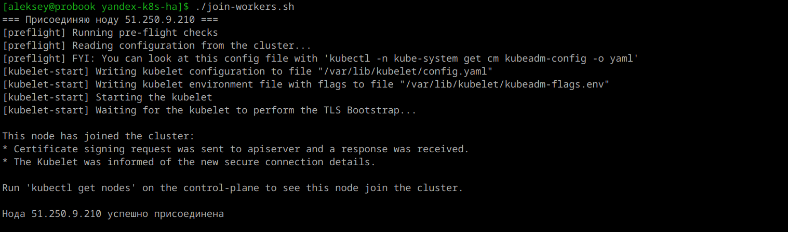
---
Проверяю статус узлов кластера:

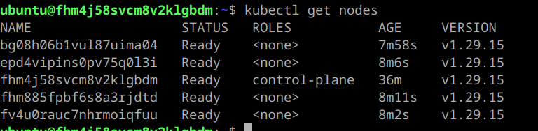
---
Выполняю тестирование работы клaстера и сетевого плагина:

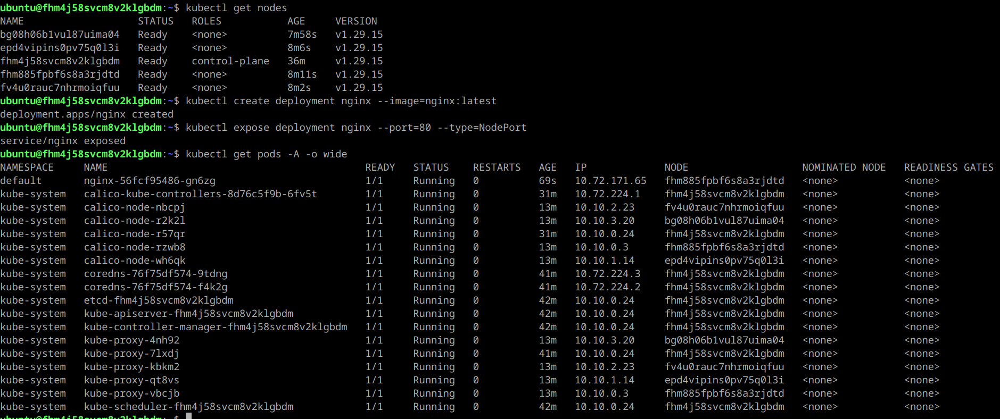
---
Устанавливаю Metrics Server, создаю конфигурацию Horizontal Pod Autoscaler (HPA) для нагрузочного тестирования и добавляю resources.requests в Deployment nginx:

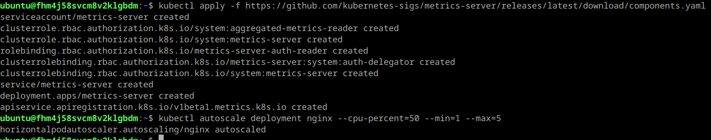
---
Запускаю поды для нагрузочного тестирования и проверяю механизм автоматического развертывания реплики при превышении порога:

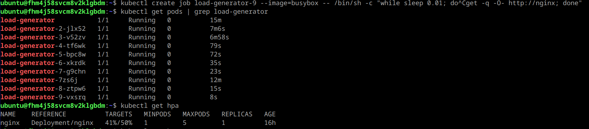
---
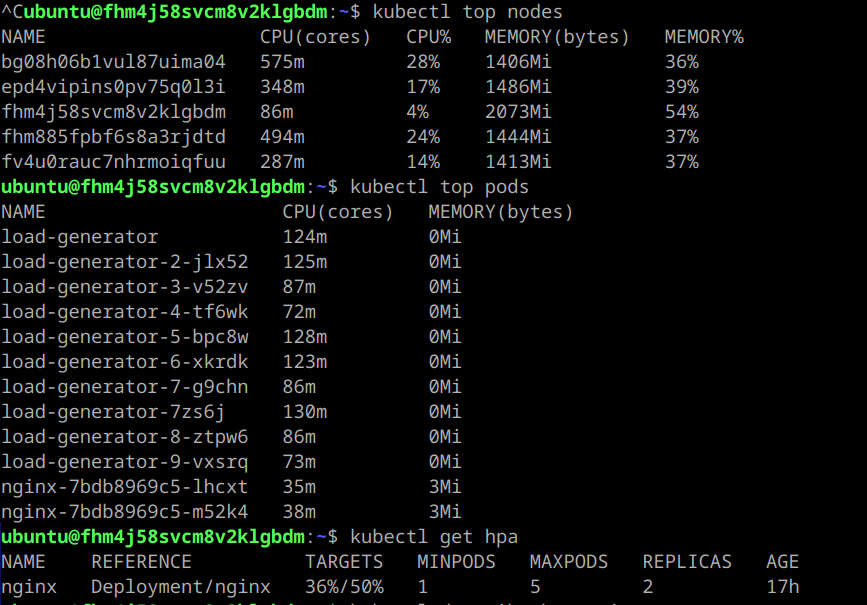
---
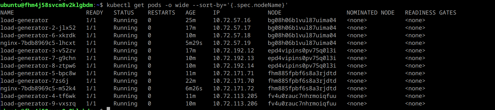
---
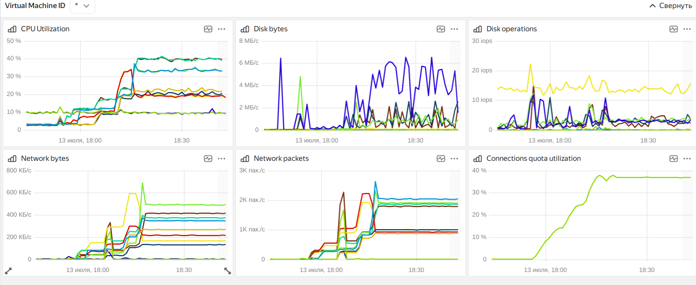
---
Кластер из 5 нод (1 мастер, 4 воркера) развернут успешно, поды взаимодействуют между собой на разных нодах в разных зонах доступности.

### Задание 2. Установить кластер k8s с 1 master node.

Для расширения кластера до отказоустойчивого использую решение [kubespray](https://kubespray.io/) по инструкции используя playbook scale.yml с версией v2.25.0. Использую terraform для генерации инвентори файла по шаблону.

