## Домашнее задание к занятию «Как работает сеть в K8s».

Настроить сетевую политику доступа к подам.

### Задание 1. Создать сетевую политику или несколько политик для обеспечения доступа.

Подготавливаю тестовый стенд в Yandex cloud из собственного репозитория: https://github.com/aleksey-dubrovin/yandex-k8s.git.

Перед началом выполняю проверку инстанса на соответствие требованиям:

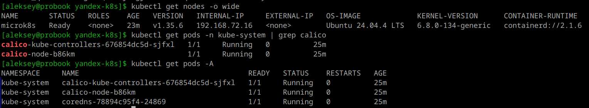
---
Фиксирую настройки ip и iptables ноды:

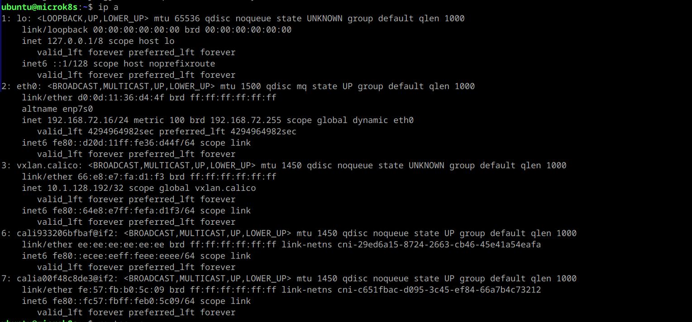
---
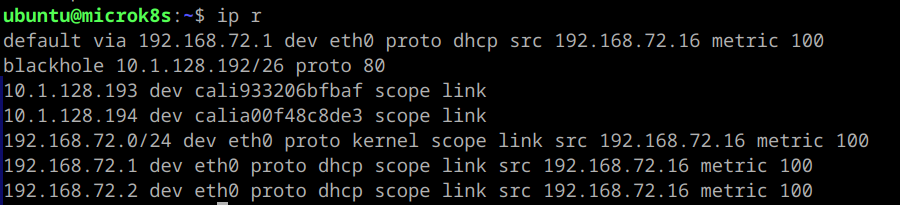
---
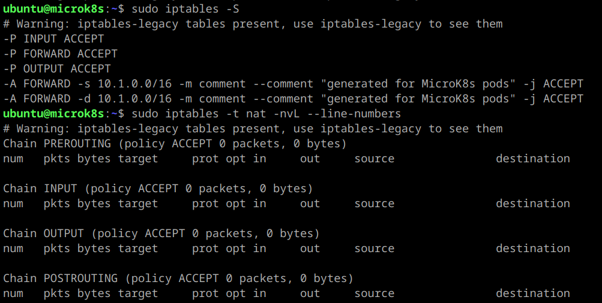
---
Устанавливаю утилиту диагностики calicoctl соответствующей версий и проверяю настройки:

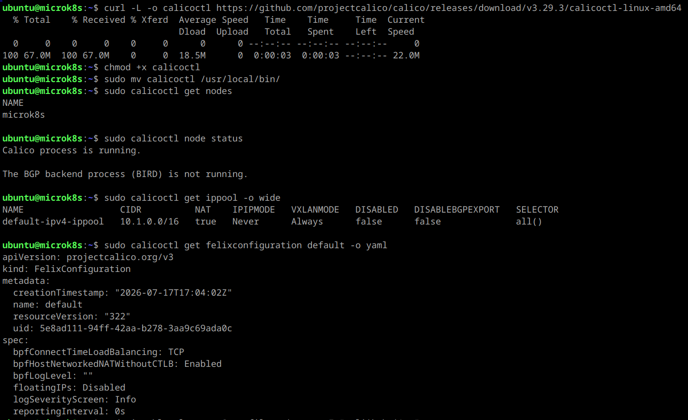
---

Применяю манифест deployments.yaml с описанием Deployment и Services для frontend, backend, cache в неймспейсе App. Все используют образ wbitt/network-multitool.

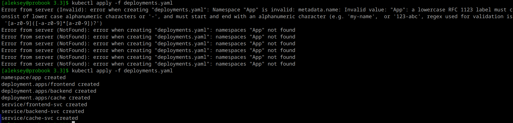
---
Получаю ошибку, испраляю на нижний регистр и применяю заново:

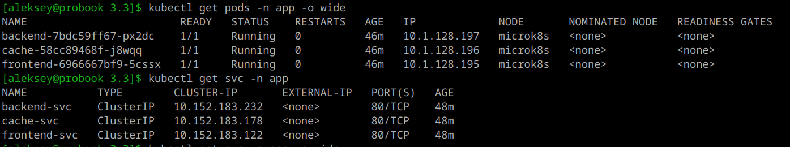
---
Применяю манифест policies.yaml с описанием NetworkPolicy и проверяю результат в namespace app:

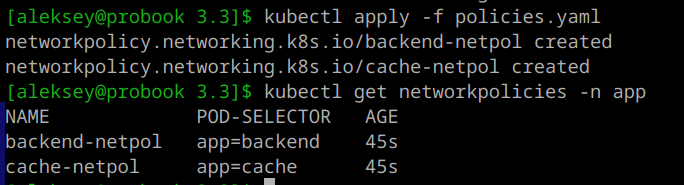
---
Проверяю доступность сервисов и параллельно запускаю tcpdump на принимающем поде:

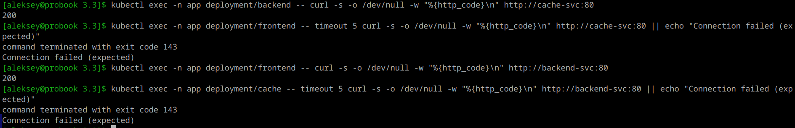
---

Проверяю доступность сервисов и параллельно запускаю tcpdump на принимающем поде:

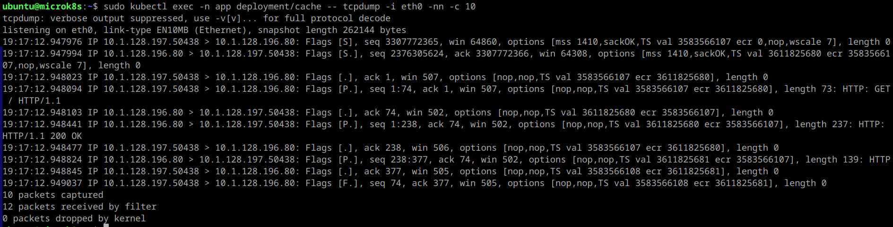
---
Проверяю созданные политики через calicoctl:

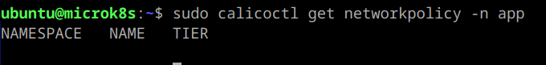
---
Удаляю стандартные Kubernetes NetworkPolicy и проверяю результат:

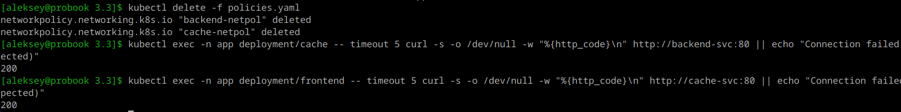
---
Настраиваю Calico NetworkPolicy через манифест calico-policies.yaml:

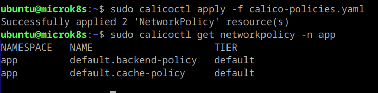
---
Проверяю результат при отсутствующих Kubernetes NetworkPolicy:

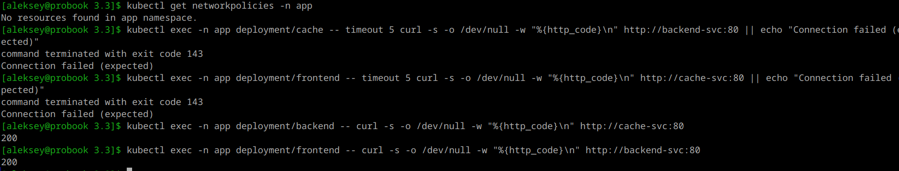
---
Логи Calico подтверждают, что политики активны и применены к подам:

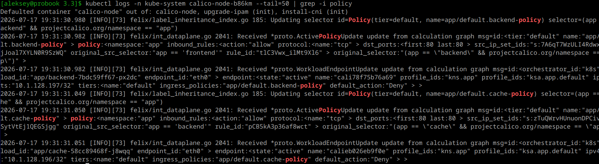
---
